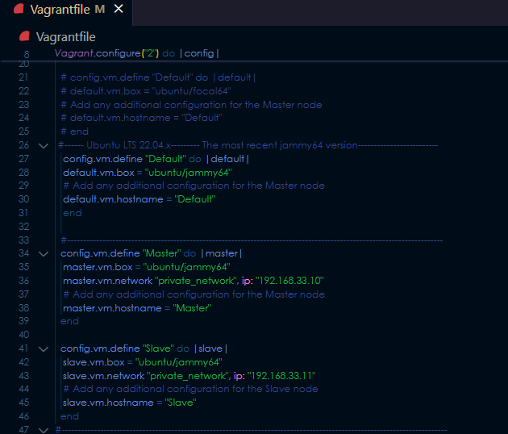
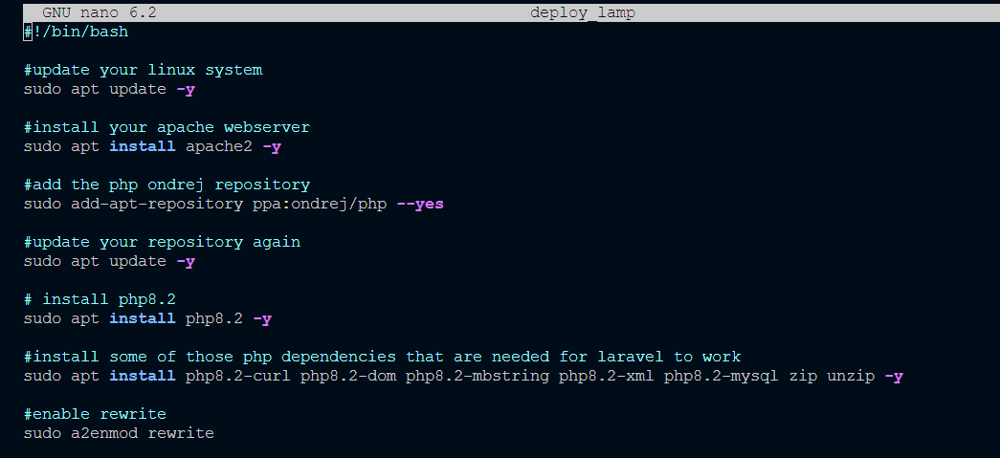
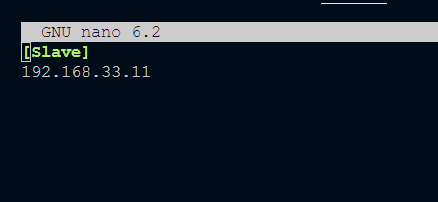
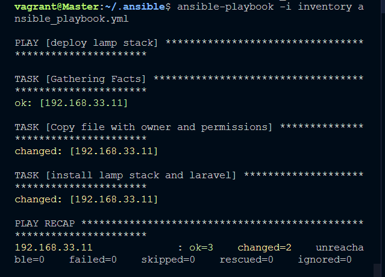
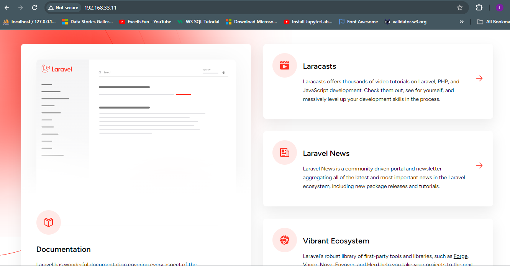

# AltSch-Sem2-Exm
```
Automate the provisioning of two Ubuntu-based servers, named "Master" and "Slave", using Vagrant.
On the Master node, create a bash script to automate the deployment of a LAMP (Linux, Apache, MySQL, PHP) stack.
This script should clone a PHP application from GitHub, install all necessary packages, and configure Apache web server and MySQL. 
Ensure the bash script is reusable and readable.
Using an Ansible playbook:
Execute the bash script on the Slave node and verify that the PHP application is accessible through the VM's IP address (take screenshot of this as evidence)
Create a cron job to check the server's uptime every 12 am.

```
1- Create 2 virtual machines (Master and Slave) using the vagrantfile config file


2 - Generate a bash script that sets up the virtual machine and its configuration. This bash is written in a file called the `deploy_lamp.sh` 
 The script is created by opening an empty file (a bash file)
- `sudo nano deploy_lamp.sh`



make the `deploy_lamp.sh` an executable by running the command below
- `chmod +x deploy_lamp.sh`

# -----------------------------------------------------

# Set up the ansible playbook
3 - Install ansible using the command below
`sudo apt install ansible`

4 - create an inventory file and an ansible playbook
The inventory file contains the Slave servers IP address


5 - create an ansible playbook that can then be ran to set up
the required `deploy_lamp.sh` on the `Slave` server.  The ansible command is
ran with the command below;
`ansible-playbook -i inventory ansible_playbook.yml`



The ansible playbook above sets up the laravel application on the Slave server
After a successful execution, the output on the Slave server should be up when the IP of the server is entered in the browser




